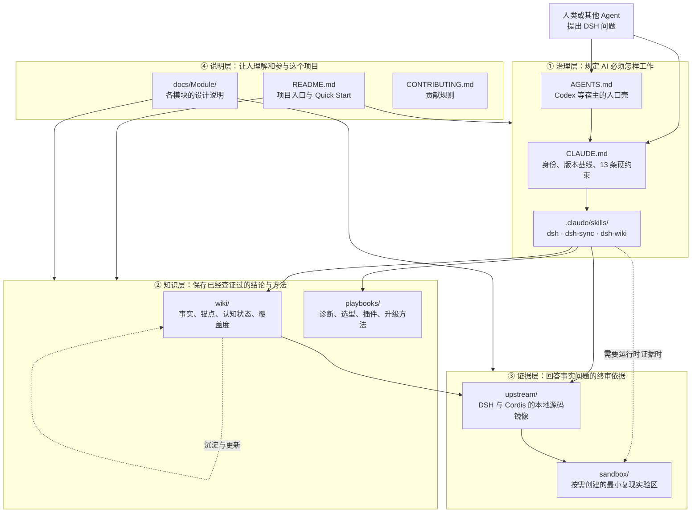
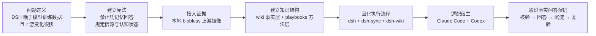
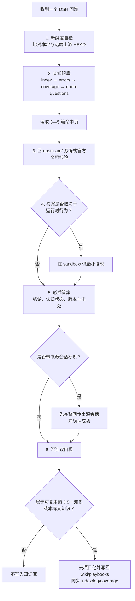

# DSH-Expert 项目地图

> 用途：向第一次接触本项目的人说明“这个文件夹为什么存在、怎样搭建、各部分做什么，以及一次 DSH 问答如何在其中流动”。

## 一句话定位

DSH-Expert 不是一个运行中的业务应用，而是一套放在 Git 仓库里的 **DSH 专家知识基础设施**：它用规则约束 AI、用 skill 编排查证流程、用 wiki 保存可追溯知识、用本地上游镜像提供源码证据，并持续检测旧知识是否已经失效。

## 总览地图



读图时可以把项目概括成四句话：

1. `CLAUDE.md` 和 `AGENTS.md` 先约束 AI，防止它凭记忆编造 DSH 事实。
2. 三个 skill 把“查新、查库、回源码、必要时实测、回答、沉淀”变成固定流程。
3. `wiki/` 与 `playbooks/` 分别保存“DSH 是什么”和“DSH 问题怎么查”。
4. `upstream/` 与 `sandbox/` 提供源码证据和运行时证据，确保结论可复核。

## 这个项目文件夹是怎样创建出来的

这里要区分“最初如何形成”和“别人如何复刻”两个问题。

### 1. 最初形成：从一次完整骨架发布开始

Git 历史能够直接证明的起点是：

```text
2026-08-24 22:53  24543aa  release: initial public release
2026-08-24 23:09  af8a568  dual-host: 适配 Codex 等 AGENTS.md 约定宿主
2026-08-28 10:42  a00542a  首次记录的上游同步与批量 stale 标记
2026-08-28 16:52  58ba1a7  加入跨会话答案交付约束
2026-08-30—31             持续通过真实问答补充和复验 wiki
```

初始公开提交不是只放了一个 README，而是一次性建立了完整闭环：双语入口文档、项目宪法、三个 skill、知识库、四本 playbook、模块文档、贡献规则和许可证，共 87 个文件。随后第二个提交加入 `AGENTS.md`，把原先面向 Claude Code 的项目扩展为 Claude Code 与 Codex 都能进入同一套规则和工作流。

这段历史说明，项目的创建思路不是“先堆资料，再慢慢整理”，而是先搭出一个最小但完整的专家系统：



注意：Git 只能证明首次公开提交时的完整快照，不能证明提交前每个文件的实际编写先后；上图是依据当前模块依赖与提交历史整理出的结构化创建路径。

### 2. 复刻这个文件夹：三次 clone + 一次启动

主仓库只跟踪专家系统本身；两个上游源码镜像各自保留自己的 Git 历史，因此放在被忽略的 `upstream/` 中。

```bash
# 1. 获取 DSH-Expert 主仓库
git clone https://github.com/yingjialong/DSH-Expert.git dsh-expert
cd dsh-expert

# 2. 获取两个只读上游镜像；它们不进入 DSH-Expert 的提交历史
git clone --filter=blob:none \
  https://github.com/deepseek-ai/deepseek-harness.git \
  upstream/deepseek-harness
git clone --filter=blob:none \
  https://github.com/cordiverse/cordis.git \
  upstream/cordis

# 3. 在仓库根目录启动任一支持的 AI 宿主
claude
# 或
codex
```

采用 `--filter=blob:none` 是为了保留完整工作树与历史 diff 能力，同时避免预先下载所有历史 blob。`sandbox/` 不需要提前创建；只有问题必须依赖运行时证据时才按需使用，并且不会提交到主仓库。

## 项目有哪些作用

| 作用 | 它解决的问题 | 主要落点 |
| --- | --- | --- |
| 把普通 AI 变成受约束的 DSH 专家 | 模型训练数据早于 DSH，不能凭记忆作答 | `CLAUDE.md`、`AGENTS.md` |
| 给每个答案建立证据链 | 结论必须能定位到版本、commit、文件或符号 | `upstream/`、wiki frontmatter |
| 防止知识随上游变化而腐烂 | 锚点命中上游 diff 后标记 `stale`，复验前不可引用 | `dsh-sync`、`wiki/` |
| 复用已经验证过的知识 | 先读紧凑索引，再只加载 3—5 篇命中页 | `wiki/index.md`、`wiki/packages/`、`wiki/topics/` |
| 复用解决问题的方法 | 把诊断、集成选型、插件开发、升级评估沉淀为剧本 | `playbooks/` |
| 标出能力边界与未知 | 记录掌握等级、错误、冲突和开放问题 | `coverage.md`、`errors.md`、`conflicts.md`、`open-questions.md` |
| 支持跨项目、跨会话协作 | 只沉淀去项目化的 DSH 知识；委派问题先回传来源会话 | `CLAUDE.md`、`dsh` skill |
| 提供必要的运行时证据 | 静态源码不能确定时，用最小复现实验验证 | `sandbox/` |

## 目录结构地图

```text
DSH-Expert/
├── README.md                  项目总入口：定位、原理、Quick Start、结构
├── CLAUDE.md                  单一约束事实源：身份、13 条硬约束、版本基线
├── AGENTS.md                  Codex 等宿主的薄入口；不复制独立事实
├── CONTRIBUTING.md            外部贡献的质量与格式要求
├── LICENSE                    MIT 许可证
│
├── .claude/skills/            专家系统的三个执行工作流
│   ├── dsh/SKILL.md            日常问答主流程
│   ├── dsh-sync/SKILL.md       同步上游并标记失效知识
│   └── dsh-wiki/SKILL.md       知识库维护与主动学习
│
├── wiki/                      事实层：DSH 是什么
│   ├── index.md                紧凑路由索引，回答前先读
│   ├── errors.md               错误本与已知陷阱
│   ├── coverage.md             各领域掌握等级 L0—L4
│   ├── conflicts.md            上游文档与源码冲突
│   ├── open-questions.md       当前仍不能回答的问题
│   ├── log.md                  问答、学习与实测时间线
│   ├── packages/               按上游 package group 组织
│   ├── topics/                 按架构、配置、版本等主题组织
│   └── integration/            按八维坐标组织集成知识
│
├── playbooks/                 方法层：DSH 问题怎么查、怎么判断
│   ├── 报错诊断.md
│   ├── 插件开发.md
│   ├── 新项目集成选型.md
│   └── 版本升级评估.md
│
├── docs/Module/               DSH-Expert 自身的模块说明
│   ├── knowledge-base.md
│   ├── playbooks.md
│   ├── skills.md
│   └── upstream.md
│
├── upstream/                  被 gitignore；两个上游仓库的本地只读镜像
│   ├── deepseek-harness/
│   └── cordis/
└── sandbox/                   被 gitignore；按需创建的一次性最小复现实验区
```

### 最容易混淆的三组边界

| 容易混淆 | 正确区分 |
| --- | --- |
| `CLAUDE.md` 与 `AGENTS.md` | 前者是完整宪法和单一约束事实源；后者只负责把 Codex 等宿主引导到同一套规则 |
| `wiki/` 与 `playbooks/` | `wiki/` 保存会随版本变化的事实；`playbooks/` 保存相对稳定的查证和决策方法 |
| DSH-Expert 主仓库与 `upstream/` | 主仓库保存专家系统；`upstream/` 保存独立上游源码镜像，已 gitignore，不会嵌入主仓库历史 |

## 一次问题如何穿过整个项目



这个闭环是项目最核心的价值：它不是“把文档放进一个文件夹”，而是把 **证据获取、认知约束、回答交付、知识沉淀和失效检测** 连成一个可重复执行的系统。

## 对外介绍时可以这样讲

### 30 秒版本

> DSH-Expert 是我为 DeepSeek Harness 建的一套 AI 专家知识基础设施。因为 DSH 晚于模型训练数据，而且版本变化很快，所以我不让 AI 凭记忆回答，而是强制它先查知识库、再回本地上游源码核验，必要时做最小实测。项目里的规则文件负责约束 AI，三个 skill 负责执行流程，wiki 保存带 commit 锚点的事实，playbooks 保存方法，上游镜像负责提供最终证据。这样每次问答既能得到可追溯答案，也能反过来让知识库持续增长，并在上游变化后自动暴露过期知识。

### 3 分钟版本的讲解顺序

1. **先讲为什么做**：新项目不在模型训练数据里，普通问答会产生幻觉；快速迭代又会让手写笔记迅速过时。
2. **再讲四层结构**：治理层、知识层、证据层、说明层。
3. **展示一次问答闭环**：查新 → 查库 → 回源码 → 必要时实测 → 回答 → 沉淀。
4. **强调两个设计点**：每条知识有 commit 锚点；`stale` 条目复验前不能引用。
5. **最后讲如何扩展**：真实问题带来新知识，`dsh-sync` 负责发现失效，`dsh-wiki` 负责维护和补学。

## 事实边界

- 创建时间、初始文件规模与后续关键阶段来自本仓库 Git 历史。
- 目录职责、工作流与 clone 命令来自当前 `README.md`、`CLAUDE.md`、`.gitignore` 和 `docs/Module/`。
- 上图中的“结构化创建路径”是对当前依赖关系与提交历史的归纳，不声称还原首次提交之前逐文件编写的真实时间顺序。
