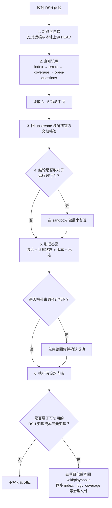

# DSH-Expert 项目地图

DSH-Expert 是一套放在 Git 仓库里的 **DSH 专家知识基础设施**。它不是业务应用；这个文件夹的核心作用，是约束 Agent 依据当前上游源码回答 DSH 问题，并把可复用结论沉淀为可追溯、可检测过期的知识。

## 目录结构地图

```text
DSH-Expert/
├── README.md                  项目入口：定位、原理、使用方式和结构
├── AGENTS.md                  规则主文件：Agent 身份、硬约束、版本基线与宿主工作流映射
├── CLAUDE.md -> AGENTS.md      Claude Code 使用的相对软链接，读取同一份规则
├── CONTRIBUTING.md            知识与文档的贡献规则
├── LICENSE                    MIT 许可证
│
├── .claude/skills/            Agent 的三个标准执行工作流
│   ├── dsh/SKILL.md            日常 DSH 问答
│   ├── dsh-sync/SKILL.md       同步上游、检测并标记过期知识
│   └── dsh-wiki/SKILL.md       知识库维护与指定领域学习
│
├── wiki/                      事实层：DSH 是什么、怎样实现
│   ├── index.md                紧凑索引；回答前先从这里定位知识
│   ├── errors.md               错误本、死路与已知陷阱
│   ├── coverage.md             各领域掌握等级 L0—L4
│   ├── conflicts.md            上游文档与源码冲突记录
│   ├── open-questions.md       已查证但仍无法回答的问题
│   ├── log.md                  问答、学习与实测时间线
│   ├── packages/               按上游 package group 组织的知识
│   ├── topics/                 架构、配置、Cordis、版本变化等主题
│   └── integration/            按八维条件组织的集成知识
│
├── playbooks/                 方法层：遇到一类问题应该怎样处理
│   ├── 报错诊断.md
│   ├── 插件开发.md
│   ├── 新项目集成选型.md
│   └── 版本升级评估.md
│
├── docs/Module/               DSH-Expert 自身的模块设计说明
│   ├── knowledge-base.md
│   ├── playbooks.md
│   ├── skills.md
│   └── upstream.md
│
├── upstream/                  被 gitignore；本地只读的上游源码证据
│   ├── deepseek-harness/       DSH 源码镜像
│   └── cordis/                DSH 底层内核源码镜像
└── sandbox/                   被 gitignore；按需使用的最小复现实验区
```

### 结构关系说明

| 模块 | 负责什么 | 不负责什么 |
| --- | --- | --- |
| `AGENTS.md` | 保存完整约束与宿主工作流映射，是项目规则的单一事实源 | 不承载具体问答知识 |
| `CLAUDE.md` | 通过相对软链接指向 `AGENTS.md`，供 Claude Code 读取 | 不维护独立规则副本 |
| `.claude/skills/` | 把规则编排成可重复执行的流程 | 不作为 DSH 事实终审来源 |
| `wiki/` | 保存带状态、版本与源码锚点的事实知识 | 不保存具体业务项目的私有结论 |
| `playbooks/` | 保存诊断、选型和查证方法 | 不保存容易随版本变化的具体事实 |
| `upstream/` | 提供 DSH 与 Cordis 的源码终审证据 | 不进入 DSH-Expert 主仓库的 Git 历史 |
| `sandbox/` | 在静态证据不足时提供运行时验证 | 不保存长期产物，不默认执行真实模型调用 |

## Agent 在项目中的角色

Agent 同时承担四个角色：

1. **DSH 领域专家**：对外给出结论先行、声明版本基线、能够追溯到上游 commit 和文件的答案。
2. **证据核验者**：不把模型记忆、旧 wiki 或第三方资料直接当事实；最终回到当前上游源码或官方文档核验。
3. **工作流执行者**：按 skill 固定顺序完成查新、查库、回源、必要时实测、答复和沉淀，不跳过关键步骤。
4. **知识库维护者**：对内持续记录错误、覆盖度、未知问题和新知识，并在上游变化后识别过期条目。

Agent 不是任何特定宿主项目的业务专家。外部项目带来的问题中，它只负责提供版本化的 DSH 事实；项目诊断、架构取舍和补丁仍由外部项目自己的 Agent 或开发者负责。

## Agent 的执行规范

| 规范 | 要求 |
| --- | --- |
| 禁止凭记忆回答 | DSH 晚于模型训练数据；任何 DSH 事实都必须在当前任务中现查 |
| 回答前查新 | 比对远端与本地上游 HEAD；本地落后时先执行同步流程 |
| 信源分级 | 上游源码是 T1 终审依据；源码与文档冲突时以源码为准并记录冲突 |
| 标明认知状态 | 区分 `fact`、`verified_inference`、`hypothesis`、`speculation`；无法确认时明确说不知道 |
| 禁止引用过期知识 | `freshness: stale` 的条目必须回源码复验后才能使用 |
| 掌握等级封顶 | L1/L2 领域最高只能给出 `verified_inference`；只有经过实测的 L3+ 才允许标 `fact` |
| 控制实测范围 | 静态证据足够就不测；运行时行为不确定时才在 `sandbox/` 做最小复现；真实模型调用必须先获授权 |
| 沉淀双门槛 | 只沉淀 DSH 知识、本库语境排障或本项目元知识；写入前还必须移除私有项目名、路径和业务逻辑 |
| 跨会话先交付 | 携带来源会话标识时，必须先完整回传答案并确认成功，之后才能修改 wiki、playbooks 或 docs |
| 固定回答尾部 | 每次回答声明版本与关键出处，并说明本次知识是否已沉淀或无需沉淀 |

## Agent 的执行流程



三个 skill 在流程中的分工：

| skill | 何时执行 | 流程 |
| --- | --- | --- |
| `dsh` | 收到任何 DSH 问题 | 新鲜度自检 → 查库 → 回源核验 → 实测判断 → 答复与交付 → 沉淀 |
| `dsh-sync` | 用户要求同步，或发现本地上游落后 | 记录旧基线 → 拉取 → 锚点 diff → 标记 `stale` → 补学变化 → 更新基线并提交 |
| `dsh-wiki` | 用户要求维护知识库或学习指定领域 | lint、查重、复验、矛盾检测、覆盖度更新；禁止后台无监督自学 |
